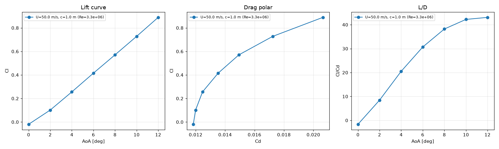
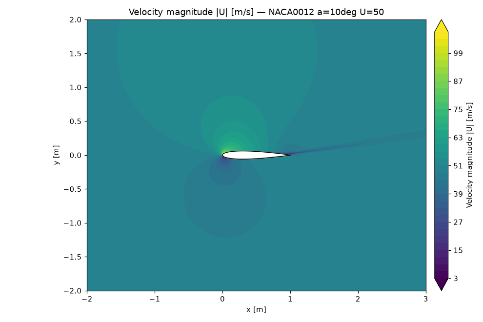
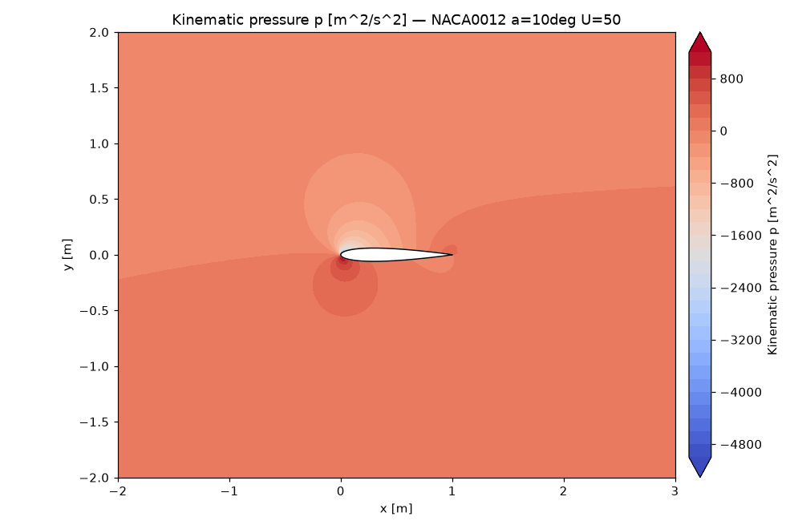
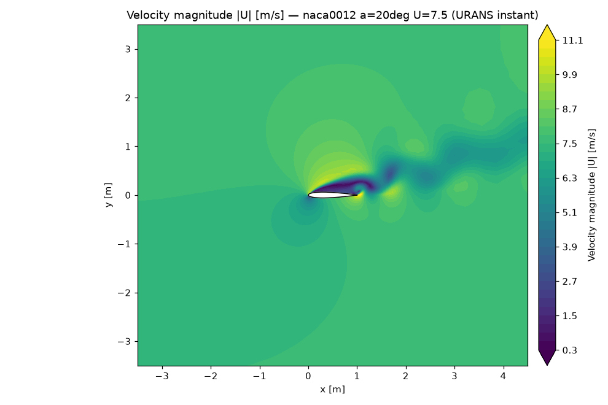
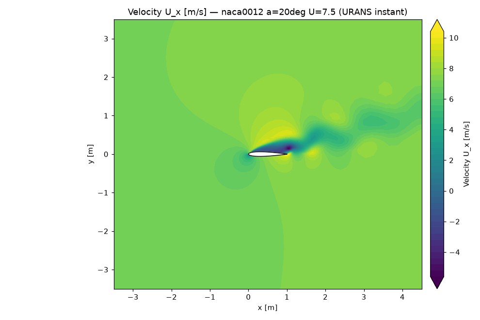
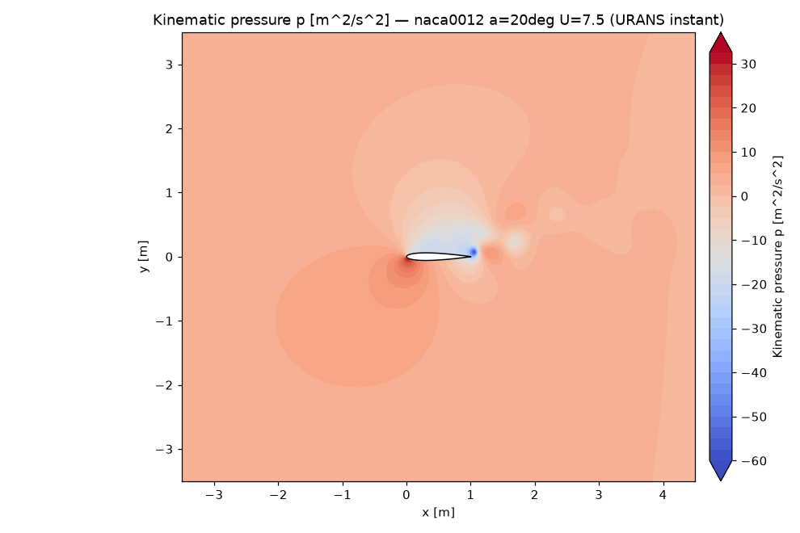

# XFoilFOAM

Compute **airfoil angle-of-attack polars** (Cl, Cd, Cm vs. AoA) with **2D RANS CFD
in OpenFOAM**, exposed as a REST API. You give it an airfoil (Selig/Lednicer
coordinates), physical dimensions, fluid properties, speed and surface roughness;
it meshes the airfoil, runs OpenFOAM in Docker, and returns polars plus contour
images (velocity, pressure, turbulence).

> Not affiliated with XFOIL. The name nods to the goal — XFOIL-style polars — but
> the engine is a real finite-volume RANS solver (OpenFOAM `simpleFoam`).

## Features

- **Airfoil input**: Selig and Lednicer coordinate formats (auto-detected), or an
  explicit point list. Geometry is chord-aligned, normalised and given a closed
  (sharp) trailing edge automatically.
- **Meshing is pluggable** (a `Mesher` interface + registry). Ships with a
  parametric **blockMesh C-grid**; the first wall-cell height is sized per case for
  a target **y+**.
- **Steady incompressible RANS** with `simpleFoam`. Turbulence models:
  `kOmegaSST` (default), `kOmega`, `kEpsilon`, `SpalartAllmaras`, and the
  **`kOmegaSSTLM` laminar-turbulent transition model** (Langtry-Menter) for
  low-Re / transitional flows.
- **Transient (URANS) fallback for unsteady flows.** When a steady case will not
  converge (typically post-stall, with massive separation and vortex shedding),
  the pipeline automatically re-runs it transient with `pimpleFoam` on a
  wall-function mesh and reports **time-averaged** Cl/Cd/Cm with their fluctuation
  (`cl_std`, …) — turning the otherwise-meaningless steady snapshot into a
  physically meaningful mean. Flagged with `unsteady: true`.
- **Angle of attack by rotating the freestream** (the mesh never moves), so a whole
  AoA polar reuses one topology. Lift/drag directions are rotated to match.
- **Sand-grain wall roughness** (`nutkRoughWallFunction`).
- **Batch requests**: one polar per `(chord, speed)` combination, each over a set/
  range of angles.
- **Outputs**: polars as JSON and CSV, convergence/residual and y+ diagnostics, and
  **contour images** (velocity magnitude/x/y, pressure, k, nut) rendered with
  matplotlib (no GPU needed).
- **Async**: FastAPI enqueues jobs to Celery/Redis; the OpenFOAM worker runs cases
  concurrently and streams progress.

## Throughput: mesh once, solve many

A polar job is organised for batch efficiency:

- **Mesh once per airfoil/chord.** `blockMesh` runs once per `(airfoil, mesh, chord)`
  and the resulting mesh is reused by every speed and angle (the steady solution
  depends only on Re, set per case). The mesh is sized for the highest Re in the
  batch. Reuse is by absolute symlink under the local runner (no copy), or copied
  into each case under the docker runner (which mounts only the case dir).
- **Solve every (speed, AoA) concurrently** (default). Each case is independent,
  cold-started with a `potentialFoam` init on the shared mesh, and run in parallel —
  the most robust and parallel option.
- **Optional warm-start marching** (`solver.warm_start=true`). Within a polar, angles
  are marched in order, each continuing from the previous converged field (only the
  velocity BC + lift/drag dirs change), skipping the per-angle `potentialFoam`. This
  helps for finely-spaced sweeps in the attached regime, but the per-angle
  `potentialFoam` init is often competitive (or better near α≈0), so it's off by
  default — benchmark it for your spacing.
- **Serial per case, parallel across cases.** 2D meshes (20–70k cells) scale poorly
  past ~2 MPI ranks, so keep `AIRFOILFOAM_SOLVER_PROCESSES=1` and get throughput from
  `AIRFOILFOAM_CASE_CONCURRENCY` (≈ cores); scale out by adding workers. Reserve a
  small `solver_processes>1` pool only for the expensive URANS (wave-2) fallback.

For database-scale runs (wave 1 steady, wave 2 unsteady), set
`solver.transient_fallback=false` for wave 1 (so post-stall points don't trigger the
costly URANS), then re-run only the flagged points with it enabled for wave 2.

## Architecture

```
client ──HTTP──▶ FastAPI (api)  ──enqueue──▶ Redis ──▶ Celery worker  (OpenFOAM image)
                    │                                      │
                    └────────── shared results volume ◀────┘   blockMesh ▶ simpleFoam ▶ foamToVTK
```

- **api** container (`docker/Dockerfile.api`): lightweight, no OpenFOAM. Validates
  requests, enqueues jobs, serves results/images from the shared volume.
- **worker** container (`docker/Dockerfile.worker`): built **FROM the OpenFOAM
  image** — the container *is* the OpenFOAM environment, so solvers run directly
  inside it (`AIRFOILFOAM_OPENFOAM_RUNNER=local`).
- For tests / local use on a host that only has the OpenFOAM *image*, a
  `DockerRunner` runs each OpenFOAM command in a fresh container.

Per-case pipeline (`airfoilfoam/pipeline.py`):
`blockMesh` → write `0/ constant/ system/` → `potentialFoam` (init) → `simpleFoam`
→ parse `forceCoeffs` → `yPlus` → `foamToVTK` → render contour images.

## Quick start (Docker Compose)

```bash
docker compose up --build        # starts redis, api (:8000) and an OpenFOAM worker
```

Submit a polar (NACA 0012, three angles):

```bash
curl -s -X POST localhost:8000/polars -H 'content-type: application/json' \
  -d @examples/naca0012_polar.json | tee /tmp/job.json
JOB=$(jq -r .job_id /tmp/job.json)

curl -s localhost:8000/jobs/$JOB            # status / progress
curl -s localhost:8000/jobs/$JOB/result     # full polars (when completed)
curl -s localhost:8000/jobs/$JOB/polar.csv  # CSV
# images are linked from each polar point, e.g.
#   /jobs/<id>/files/cases/<case>/images/velocity_magnitude.png
```

Interactive docs: <http://localhost:8000/docs>.

## Example output

A NACA 0012 polar at Re = 3.3×10⁶ (k-ω SST), AoA 0–12°, computed by the full
stack against real OpenFOAM (all points converged):



Contour images returned per AoA (velocity magnitude and pressure at 10°):




Regenerate the polar plot from a job result with
`python examples/plot_polar.py result.json out.png`.

### Deep stall: the transient (URANS) fallback

At AoA = 20° the flow is **massively separated and unsteady**, so a steady solver
cannot converge. The pipeline detects this and automatically re-runs the case as a
`pimpleFoam` URANS, time-averaging the forces. Below is an *instantaneous* snapshot
from such a run (NACA 0012, Re ≈ 5×10⁵), computed end-to-end against real OpenFOAM —
the von-Kármán-style vortex street shed off the stalled airfoil is exactly what the
steady solver could not represent:



Streamwise velocity makes the separation explicit — the dark region is **reversed
flow** (negative `Uₓ`, i.e. recirculation) covering the entire suction side and wake:



The instantaneous pressure field shows the low-pressure cores of the shed vortices
convecting downstream:



For this case the fallback reports **time-averaged Cl ≈ 0.75, Cd ≈ 0.33** with
fluctuation amplitudes `cl_std ≈ 0.05`, `cd_std ≈ 0.01` (returned as `cl_std`/`cd_std`
and flagged `unsteady: true`) — a physically meaningful mean and unsteadiness measure,
instead of the meaningless single iterate a non-converged steady run would return.

## API

| Method & path | Purpose |
|---|---|
| `GET /health` | liveness |
| `GET /capabilities` | available meshers, turbulence models, OpenFOAM image |
| `POST /airfoils/parse` | validate/parse an airfoil, report points & thickness |
| `POST /polars` | submit a job → `202` with `job_id` |
| `GET /jobs/{id}` | job status & progress (`total_cases` / `completed_cases`) |
| `GET /jobs/{id}/result` | polars (Cl/Cd/Cm, y+, convergence, image URLs) |
| `GET /jobs/{id}/polar.csv` | polars as CSV |
| `GET /jobs/{id}/files/{path}` | fetch a result file (images, logs) |

See `examples/naca0012_polar.json` for the full request schema (also documented at
`/docs`).

## Running without the broker (CLI)

The package installs an `airfoilfoam` CLI:

```bash
airfoilfoam run examples/naca0012_polar.json   # runs synchronously, prints JSON
airfoilfoam serve                              # run the API
airfoilfoam worker                             # run a Celery worker
```

`airfoilfoam run` executes the same pipeline used by the worker, writing results
under `$AIRFOILFOAM_DATA_DIR/jobs/<id>/`.

## Configuration (env vars, prefix `AIRFOILFOAM_`)

| Variable | Default | Meaning |
|---|---|---|
| `DATA_DIR` | `/data/airfoilfoam` | results/cases storage (shared by api+worker) |
| `OPENFOAM_IMAGE` | `opencfd/openfoam-default:2406` | image for the docker runner |
| `OPENFOAM_RUNNER` | `docker` | `docker` (one container per command) or `local` (inside the worker) |
| `OPENFOAM_BASHRC` | `/usr/lib/openfoam/openfoam2406/etc/bashrc` | sourced before solvers |
| `REDIS_URL` | `redis://localhost:6379/0` | Celery broker & backend |
| `CASE_CONCURRENCY` | `4` | cases run in parallel per job |
| `SOLVER_PROCESSES` | `1` | MPI ranks per case (`>1` → decomposePar/mpirun/reconstructPar) |
| `SOLVER_TIMEOUT` | `7200` | per-case timeout (s) |

## Accuracy & meshing notes

The defaults are tuned for **robustness** (a converged, steady, physically sensible
solution across a wide AoA range) rather than absolute accuracy:

- The solver uses **plain SIMPLE** with under-relaxation (p 0.3, U 0.7, turbulence
  0.5), 2 non-orthogonal correctors and a `potentialFoam` initialisation. The
  far-field is a proper **inlet / pressure-referenced outlet** (fixed p=0 at the
  outlet) rather than a single freestream patch — this gives the pressure equation a
  solid reference and is what makes the delicate symmetric (AoA=0) case converge
  deterministically. The pipeline reports a case as converged when the residual
  control is met *or* Cl/Cd are steady over the last 200 iterations
  (`force_is_steady`).
- **Automatic robustness fallback.** If a case still diverges with 2nd-order
  convection, the pipeline re-runs it once with 1st-order upwind (more dissipative
  but stable) and flags the point with `first_order_fallback`.
- Defaults target **y+ ≈ 1** (the first-cell height is computed per case from a
  flat-plate estimate). You can instead set `mesh.first_cell_height_chords` directly.
- **Known limitation — lift is conservative.** The parametric blockMesh C-grid has
  moderate trailing-edge skewness / non-orthogonality, which systematically
  *under-predicts* the lift slope (typically ~20–40% low vs. wind-tunnel data) and
  shifts the centre of pressure forward. Drag is the right order of magnitude;
  trends (Cl increasing with AoA, roughness increasing drag, polar shape) are
  correct. Treat absolute numbers as engineering estimates and **validate against
  reference data** for quantitative work. The meshing layer is pluggable
  (`Mesher` registry) precisely so a higher-fidelity mesher (hyperbolic/elliptic,
  Gmsh, snappyHexMesh) can be dropped in for better accuracy.
- Lift also rises with **domain size**; increase `mesh.farfield_radius_chords` and
  resolution (`mesh.n_surface/n_radial/n_wake`) for more accuracy at higher cost.
  Very fine wall spacing (y+≪1) on a large domain can produce extreme aspect ratios
  near the wake — keep `n_*` and the domain in proportion.

### Post-stall and low-Re flows

- **Post-stall is unsteady**, so a steady solver cannot give a meaningful answer —
  it never converges and returns whatever iterate it stopped on. The transient
  fallback (above) handles this: it runs a `pimpleFoam` URANS on a coarser
  wall-function mesh (post-stall flow is pressure-dominated; a y+~1 wall would
  throttle the time step) and time-averages the forces. The `cl_std`/`cd_std`
  fields report the fluctuation amplitude — large in deep stall, which is correct.
  Tune `solver.transient_cycles`, `transient_discard_fraction` and
  `transient_max_courant`; 2D URANS captures the shedding and mean trends but for
  quantitative deep-stall loads a 3D DES/DDES run is the gold standard.
- **Low Reynolds (≈10⁵)** is transitional (laminar separation bubbles). Fully
  turbulent models are inappropriate there; use `solver.turbulence.model =
  kOmegaSSTLM`. Transition is very sensitive to the freestream turbulence — set
  `solver.turbulence.intensity` to the real Tu (e.g. 0.001 for clean external flow).

## Development & tests

```bash
python -m venv .venv && . .venv/bin/activate
pip install -e ".[dev]"
pytest -m "not integration"     # fast unit tests, no Docker
pytest -m integration           # real OpenFOAM runs (needs Docker + the image)
```

## License

MIT — see [LICENSE](LICENSE).
